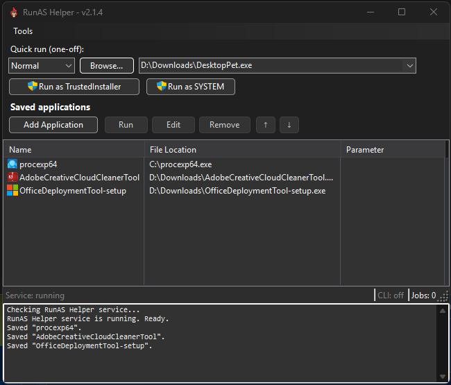
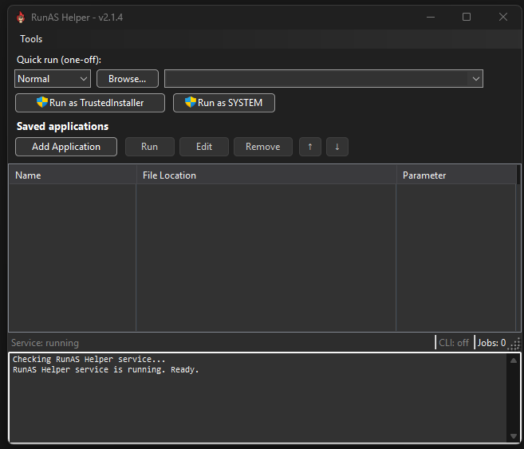
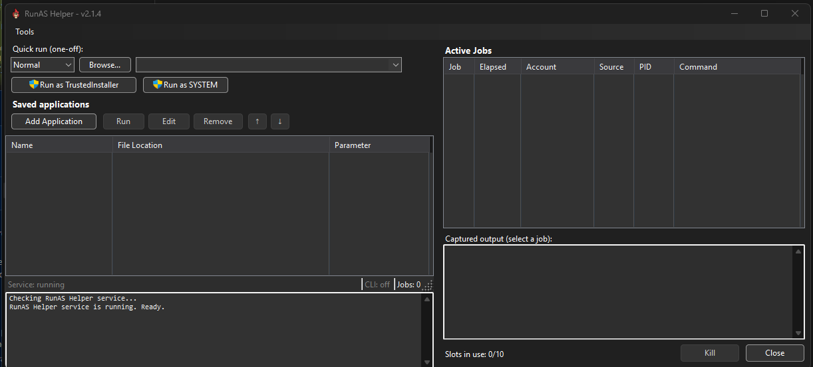
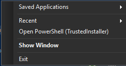
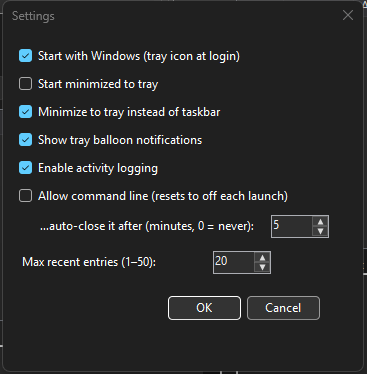

# RunAS Helper

Launch any program as **TrustedInstaller** — the highest privilege level on Windows, above standard Administrator — from a system-tray app or a one-line command.

[](https://github.com/bigfnj/runas-helper/actions/workflows/release.yml)



Quick run takes a one-off path and launches it as TrustedInstaller or SYSTEM.
Saved applications keep the things you run often. The Active Jobs pane lists what
is currently running, with its account, source, PID and captured output, and can
kill any of it. The status bar shows whether the service is up, whether the
command-line gate is open and for how long, and how many of the ten launch slots
are in use. Dark mode follows the system theme.

---

## Why

Some files, registry keys, and services are owned by `NT SERVICE\TrustedInstaller` and are off-limits even to an elevated Administrator. Editing a protected system file, replacing a guarded driver, or poking a locked-down service normally means manually hijacking the TrustedInstaller token by hand. RunAS Helper does that for you and gives you a `TrustedInstaller`-level process — a shell, an editor, whatever you point it at.

> ⚠️ **This is a power tool for system administration and troubleshooting.** A TrustedInstaller process can modify or destroy any part of Windows. Use it deliberately.

## How it works

RunAS Helper is two cooperating processes:

```
  ┌─────────────────────┐         named pipe          ┌──────────────────────────┐
  │  RunAsHelper.exe     │   \\.\pipe\RunAsHelper      │  RunAsHelper.Service      │
  │  tray app + CLI      │ ──────────────────────────► │  Windows service          │
  │  (runs as you/admin) │   LaunchRequest (JSON)      │  (runs as LocalSystem)    │
  │                      │ ◄────────────────────────── │                          │
  └─────────────────────┘   log + result stream        └────────────┬─────────────┘
                                                                     │ impersonates winlogon,
                                                                     │ steals the TrustedInstaller
                                                                     │ token, remaps it to your
                                                                     ▼ desktop session
                                                          your program, running as
                                                          NT SERVICE\TrustedInstaller
```

1. The **client** (tray app or CLI) sends a launch request over a named pipe.
2. The **service**, running as LocalSystem, enables `SeDebug`/`SeImpersonate`/`SeTcb`, impersonates `winlogon.exe`, starts the `TrustedInstaller` service, and duplicates its access token.
3. It remaps that token to the requesting client's session so the new process shows up on **your** desktop instead of the invisible Session 0, then launches it via `CreateProcessAsUserW`.

### Security model

The named pipe ACL grants access to BUILTIN\Administrators, SYSTEM, and the interactive session — this lets endpoint-privilege-management tools (Avecto, BeyondTrust, CyberArk, etc.) elevate a standard-user tray process on-demand.

The service enforces identity server-side, not via the client-supplied `Source` field:

- **Tray control** (`setcli`, saving settings, validation): requires the client to be both the installed `RunAsHelper.exe` — identified by image path (the binary sitting next to the service), so unsigned local/CI builds still work — **and** running with an elevated token. Neither condition alone is sufficient. A caller's Authenticode signature is recorded for diagnostics; pinning it to a specific publisher was considered and closed (see *Project status*).
- **CLI gate** (any other process): when the elevated tray opens the gate, **any** process that can reach the pipe gets elevated to TrustedInstaller — the pipe ACL is the boundary. The gate resets whenever the owning tray exits or crashes, and it **auto-closes after a configurable ceiling** (default 30 minutes) so an allowance cannot be left open indefinitely.

> **The CLI gate is a session-wide grant, by design.** The pipe ACL includes the
> `INTERACTIVE` SID, so while the gate is open, *any* process in the interactive
> session can launch as TrustedInstaller — including a non-elevated one, and
> including one belonging to a standard user who is not an administrator. That is
> the intended behaviour, not an oversight: the gate exists so that scripts and
> non-elevated automation can use the service without each caller needing its own
> elevation. An administrator opens it deliberately, it is off by default, and it
> closes itself after `CliGateMinutes`.
>
> The consequence is worth stating plainly: **on a machine with users you do not
> trust, do not open the gate.** Treat opening it as equivalent to handing the
> whole interactive session SYSTEM rights for that window. If you need a tighter
> boundary, narrow the `INTERACTIVE` rule in `PipeServer.CreatePipe()` to the SID
> of the user who owns the tray.
- **Job control** (`jobs`, `killjob`): same requirement as tray control — the installed, elevated tray. Deliberately *not* reachable through an open CLI gate: being allowed to launch must not imply the right to enumerate or terminate other elevated jobs.

Keep the pipe ACL and the install-path identity check intact if you modify the pipe security.

## Install

**Prerequisite: the [.NET 10 Desktop Runtime (x64)](https://dotnet.microsoft.com/download/dotnet/10.0).**
Setup checks for it and stops on a page with a download link if it is missing, so
you cannot end up with an installed service that will not start. Installs run with
`/qn` or `/qb` have no dialogs, so those abort with the same message instead.

1. Download `RunAsHelper-Setup-<version>.msi` from the [latest release](https://github.com/bigfnj/runas-helper/releases/latest).
2. Run it (it's a per-machine install and needs elevation):
   ```
   msiexec /i RunAsHelper-Setup-<version>.msi /passive
   ```

Releases through 2.1.3 bundled the runtime and needed no prerequisite, at the cost
of a 65.8 MB installer that was 99.6% Microsoft's code. 2.1.4 is 1.5 MB. See
[What's new in 2.1.4](#whats-new-in-214).

The installer:

- installs the **RunASHelper** Windows service (LocalSystem, auto-start),
- installs the tray app and a Start Menu shortcut,
- optionally launches the tray right after install (Finish-dialog checkbox).

The tray runs **non-elevated** and registers its own per-user login auto-start
(an `HKCU\…\Run` entry that opens just the tray icon). Click the tray's
**Activate** button to elevate on demand (no standing scheduled task).

### Publisher

Released builds are **Authenticode-signed** by a self-signed *Serenity Software*
certificate, RFC3161-timestamped, and the release workflow fails rather than
publishing if the MSI or either EXE comes back unsigned, wrongly signed or
untimestamped.

Self-signed means **Windows will report an unknown publisher**, and there is
nothing you need to do about that. Everything installs and runs normally. Expect
a SmartScreen prompt on first download and a UAC dialog without a publisher name.

**The installer will never ask you to trust a certificate.** Releases up to and
including 2.1.2 offered an off-by-default checkbox that imported the public half
of that self-signed root into `LocalMachine\Root`. That was retired: a public
download has no business asking a stranger to add a root CA, because trusting it
trusts *anything* signed with that key rather than just this app, and it was never
removed on uninstall. If you ticked that box on an older build, the certificate is
still in your Trusted Root store and you may want to remove it:

```
certutil -delstore Root 0EEBB64DCE430D98D2CA19DC3DC715DB9999BAD5
```

A properly issued certificate is the actual fix and is the plan. The code is still
in the tree behind a build flag, described in
[`Package.wxs`](RunAsHelper.Installer/Package.wxs), so the history is auditable
rather than quietly rewritten.

> **History, since it is easy to misread the older releases:** builds before
> 2.1.2 were unsigned, and the certificate page, added in 1.5.7, never actually
> appeared. It was published as a control event ordered after WixUI's own
> `EndDialog`, so the install always began before the page was reached. 2.1.2
> fixed the ordering, which meant the page appeared in exactly one release before
> being retired for the reasons above.

### Uninstall

```
msiexec /x RunAsHelper-Setup-<version>.msi /passive
```
…or via *Settings → Apps → RunAS Helper*. This stops and removes the service and the shortcut. (Remove the per-user login auto-start, if you want it gone, via *Settings → Apps → Startup* or by deleting the `RunAsHelper` value under `HKCU\Software\Microsoft\Windows\CurrentVersion\Run`.)

## Usage

### Tray app

Launch **RunAS Helper** from the Start Menu, or let it start at login as a tray
icon (see *Startup* below). The main window is a **saved-applications manager**:

- **Saved applications** — a list (Name / File Location / Parameter). **Add
  Application** stores a launch with its location, arguments, working directory,
  **window state** (Normal / Minimized / Maximized / Hidden), priority, and
  **account** (TrustedInstaller or SYSTEM). Double-click or **Run** to launch;
  **Edit** / **Remove** / **↑ ↓** to manage (Del / F2 / Enter shortcuts).
- **Quick run (one-off)** — launch a path once without saving it: pick a
  priority, type or **Browse…** to a path, then click **Run as TrustedInstaller**
  or **Run as SYSTEM** (the button you click chooses the account).
- **Tools menu** — Settings, Validate Installation, **Active Jobs**, Open PowerShell
  (TrustedInstaller), Import/Export saved apps, and **How to Use**.
- **Status bar** — three live indicators along the bottom: the **service** state, the
  **CLI gate** (`CLI: off`, or `CLI: open` with the time left), and the **Jobs:** slot count.
  The last two are clickable: the gate label opens the gate for the configured duration, and
  the job count expands the Active Jobs pane. It only polls the service while the window is
  on screen.
- **Active Jobs** — a collapsible pane on the right of the main window: what is currently
  holding a service launch slot, with live slot usage, each job's captured output, and a
  **Kill** button for one that is stuck. Click the status bar's **Jobs:** count (or *Tools →
  Active Jobs*) to expand it, and again to collapse it. Needs an elevated tray to list
  anything.

The pane starts collapsed, so the window is just the list and the log:



Expanding it **widens** the window rather than squeezing the list, and collapsing
gives the width back:



**From the tray.** Right-click the tray icon to run a saved application or a
recent one without opening the window, or to open a TrustedInstaller PowerShell
directly:



**Elevation (Activate).** The tray runs **non-elevated** (greyed icon). The
service's control pipe only admits elevated administrators, so click the
**Activate** bar to relaunch elevated (via your OS/endpoint elevation prompt);
the bar disappears once elevated and the icon turns colour when the service is
reachable.

**Accounts.** *TrustedInstaller* launches with a SYSTEM token carrying the
`NT SERVICE\TrustedInstaller` group (needed for TI-owned files/keys/services);
*SYSTEM* launches with a plain LocalSystem token. Because the TrustedInstaller
service runs as LocalSystem, `whoami` reads `nt authority\system` for both — the
difference is the TrustedInstaller group membership.

**Startup.** *Settings → Start with Windows* (on by default) registers a per-user
`HKCU\…\Run` entry that opens the tray icon at login (window stays closed until
you click it). There is **no scheduled task**.

**Theme.** *Settings → Theme* selects **Follow system** (default), Light, or Dark. While
following the system it repaints live when Windows switches.



**After installing.** The installer starts the tray once with `--postinstall`,
which runs an installation check: service reachable over the pipe, tray running,
and both a TrustedInstaller and a SYSTEM token actually acquired and released. It
shows once per installed version, and *Tools → Validate Installation* runs it
again on demand. The token checks need an elevated tray; from a non-elevated one
they report that they could not be checked rather than that they failed.

Settings are stored in `%AppData%\RunAsHelper\settings.json`.

### Command line

```
RunAsHelper.exe [/capture] [/timeout:N] [/p:N] [/as:ACCOUNT] <path> [args]
RunAsHelper.exe /jobs                 :: list launches holding a slot
RunAsHelper.exe /kill:<id>            :: terminate one of them
RunAsHelper.exe /joblog:<id>          :: show what one of them has printed
RunAsHelper.exe -h | --help | /?      :: show full help
```

| Flag          | Meaning                                                                        |
|---------------|--------------------------------------------------------------------------------|
| `/p:1`        | Normal priority (default)                                                      |
| `/p:2`        | Idle                                                                           |
| `/p:3`        | High                                                                           |
| `/p:4`        | Realtime                                                                       |
| `/p:5`        | Below Normal                                                                   |
| `/p:6`        | Above Normal                                                                   |
| `/as:ti`      | Run as TrustedInstaller (default)                                              |
| `/as:system`  | Run as plain LocalSystem                                                       |
| `/capture`    | Stream child stdout/stderr back through the pipe; CLI blocks until child exits |
| `/timeout:N`  | Hard ceiling in seconds; on timeout the stream closes, child is left running   |
| `/jobs`       | List launches holding a slot (id, elapsed, account, source, PID, command)      |
| `/kill:<id>`  | Terminate the process behind an in-flight job                                  |
| `/joblog:<id>`| Show the output an in-flight capture job has produced so far                   |

Non-executable targets are launched via their host automatically (`.msc`→`mmc`,
`.cpl`→`control`, `.bat`/`.cmd`→`cmd /c`, `.ps1`→`powershell`, `.reg`→`regedit /s`, and any
other document via its registered handler), and a bare name
(e.g. `notepad.exe`, `lusrmgr.msc`) is resolved on the PATH — including when
arguments follow, so targets outside `System32` such as `powershell.exe` launch
correctly too.

```bat
:: Open a TrustedInstaller command prompt
RunAsHelper.exe cmd.exe

:: Launch regedit at high priority
RunAsHelper.exe /p:3 regedit.exe

:: Run as plain SYSTEM
RunAsHelper.exe /as:system cmd.exe

:: Run a PowerShell command as SYSTEM (see "Passing arguments" below)
RunAsHelper.exe /as:system powershell.exe -NoProfile -Command "Restart-Service WSLService -Force"

:: Stream child output back to the caller (blocks until the script exits)
RunAsHelper.exe /capture /as:system powershell.exe -NoProfile -Command "Get-Service Wuauserv"

:: Capture with a 30-second timeout; child is left running if it doesn't finish
RunAsHelper.exe /capture /timeout:30 /as:system powershell.exe -NoProfile -File C:\scripts\fix.ps1

:: Quote paths that contain spaces
RunAsHelper.exe "C:\Program Files\Some Tool\tool.exe" --flag
```

#### Passing arguments

Everything after the target path is forwarded to it. Two rules keep the
arguments intact — get these wrong and the target may start but do nothing:

- **Pass each switch as its own token; quote only the parts that contain
  spaces** (typically just a `-Command`/`-c` script block). The CLI re-quotes any
  *single* argument that contains a space, so a whole multi-switch command bundled
  into one quoted string arrives at the target as one unparseable token. Given
  such a blob, `powershell.exe` starts and exits without running anything —
  `cmd.exe` only survives it because it re-parses the line internally, which is
  what can make a `cmd /c …` wrapper look "required" when it isn't.

  ```bat
  :: GOOD — switches are separate tokens; only the script block is quoted
  RunAsHelper.exe /as:system powershell.exe -NoProfile -Command "Get-Service WSLService | Restart-Service -Force"

  :: BAD — the entire argument string is one quoted blob; PowerShell can't parse it
  RunAsHelper.exe /as:system powershell.exe "-NoProfile -Command Get-Service WSLService | Restart-Service -Force"
  ```

- **Don't add `-ExecutionPolicy Bypass` for an inline `-Command`.** Execution
  policy applies only to script *files* (`.ps1`), never to `-Command`, so it is
  noise there. The tool already supplies it when *it* hosts a `.ps1` for you (the
  host-mapping above). Note that where execution policy is enforced by Group
  Policy, the switch is ignored for `.ps1` regardless.

The CLI streams the service's log lines to stdout and exits `0` on success, `1`
on failure. It requires the **RunASHelper** service running and an elevated
context (see the gate note below).

> 🔒 **The command line is disabled by default.** As a hardening measure, the
> service rejects CLI-sourced launches unless you enable them this session via
> *Settings → "Allow command line"* (off again on every tray launch/exit). The
> tray's own launches are unaffected. When the gate is open, **any** process that
> can reach the pipe is elevated — the pipe ACL (Administrators + interactive
> session) is the boundary, not per-caller elevation.
>
> **To use the CLI:** open the tray, click **Activate** (approve your OS/endpoint
> elevation prompt), then toggle *Settings → "Allow command line"*. That allowance
> **expires on its own** after *Settings → "…auto-close it after"* minutes (default 30;
> 0 disables the countdown). The service enforces it, so an allowance you forget about
> closes itself; re-ticking the box starts a fresh countdown. Only the
> elevated, installed tray can open the gate, and it closes again when the tray
> exits — so re-enable it per session. An already-elevated tray launches without
> needing the gate at all; the gate exists for *non-elevated* CLI callers.
>
> **Awareness:** while the tray is running it watches the service's event log and
> shows a tray balloon for every *command-line*-sourced launch, so an escalation
> made through the open gate that you didn't initiate is flagged immediately.

## Build from source

**Requirements:** Windows, [.NET 10 SDK](https://dotnet.microsoft.com/download). The WiX 4 toolset is pulled in automatically as a NuGet package — nothing else to install.

```
dotnet build RunAsHelper.sln -c Release
```

This produces a single-file, framework-dependent installer at:

```
RunAsHelper.Installer\bin\x64\Release\RunAsHelper-Setup.msi
```

To stamp a specific version into the MSI **and** the EXE `FileVersion`/`AssemblyVersion` (the release workflow does this from the git tag):

```
dotnet build RunAsHelper.sln -c Release -p:ProductVersion=1.2.3
```

### Signing

Signing is opt-in at the MSBuild level. The installer's sign targets fire only
when `-p:SigningCertThumbprint` and `-p:SignToolPath` are supplied, so a plain
`dotnet build` is **unsigned** and fully supported: the service trusts the tray by
install path, not by signature.

**Released builds are signed by CI.** The release workflow imports the signing key
from repository secrets, signs both published EXEs before WiX packs them and the
MSI after link, then verifies all three came back valid, correctly signed and
timestamped before publishing anything. A build with no signing secret available
produces an unsigned installer and a warning rather than failing, so a fork still
works.

To sign locally, use the scripts in [`signing/`](signing):

```powershell
# One-time: create a self-signed code-signing cert (CN=Serenity Software) in your
# user store and, with -TrustMachine (elevated), trust it on this machine.
.\signing\New-SigningCert.ps1 -TrustMachine

# Build a signed release. Resolves signtool + the cert, signs both EXEs before
# WiX packs them, then signs the MSI (RFC3161-timestamped when reachable).
.\signing\Build-Signed.ps1 -Version 1.6.3
```

The public certificate is committed at `signing/serenity-software.cer`. Private
keys (`*.pfx`/`*.p12`) are git-ignored and are never committed.

Be clear-eyed about what this certificate is: a self-signed root with a
code-signing EKU, which nobody's machine trusts by default and which earns no
SmartScreen reputation. Its only real function now is proving a release came from
this pipeline unmodified. Signing in CI means the Actions environment holds the
private key, so treat a leak of `SIGNING_PFX_BASE64` as needing a new key rather
than as a non-event.

What made that key genuinely dangerous was the retired installer trust step,
because anyone holding the key could then sign anything and have it validate as
*Serenity Software* on every machine that had ticked the box. With that gone the
blast radius is this repository's own releases. It is still the wrong long-term
answer, and a purchased certificate replaces both the key and this section.

### Installer artwork

`dialog.bmp` and `banner.bmp` in `RunAsHelper.Installer` are committed because WiX
needs them at build time and CI has no image tooling. Regenerate them from the
source artwork with
[`RunAsHelper.Installer/New-InstallerArt.ps1`](RunAsHelper.Installer/New-InstallerArt.ps1)
rather than editing them by hand; it needs ImageMagick.

Keep the area outside the 165px artwork strip light. ExitDialog draws its heading
onto it in dark text and the optional launch checkbox paints an opaque white
rectangle over it, so a dark fill there produces unreadable headings with a white
box through them. That was the 2.1.4 fix.

Give each installed build a **distinct** version — Windows Installer can't tell
two builds apart if they share a `ProductVersion`, so a same-version reinstall
may silently keep the old bits. The tray shows its running version in the window
title to make this unambiguous.

### Projects

| Project | Output | Role |
|---|---|---|
| `RunAsHelper` | `RunAsHelper.exe` | Tray GUI + CLI client (WinForms) |
| `RunAsHelper.Service` | `RunAsHelper.Service.exe` | LocalSystem Windows service; performs the elevation |
| `RunAsHelper.Shared` | library | Named-pipe wire protocol (framed JSON) |
| `RunAsHelper.Installer` | `RunAsHelper-Setup.msi` | WiX 4 installer; publishes both apps framework-dependent single-file and embeds them |

## Releasing

Releases are built by [`.github/workflows/release.yml`](.github/workflows/release.yml) on a Windows runner.

- **Cut a release:** push a version tag.
  ```
  git tag v1.2.3
  git push origin v1.2.3
  ```
  The workflow builds `RunAsHelper-Setup-1.2.3.msi` (with `ProductVersion=1.2.3`) and attaches it to a new GitHub Release with auto-generated notes.
- **Dry run:** *Actions → Release → Run workflow*, supply a version. This builds and uploads a downloadable artifact but does **not** create a Release.

Use increasing versions for successive releases. `MajorUpgrade` detects and
replaces a prior install; `AllowSameVersionUpgrades` lets an equal version
reinstall in place (handy during development).

## What's new in 2.1.4

- **The installer is 1.5 MB instead of 65.8 MB.** Both executables were published
  self-contained, so each carried its own private copy of the entire .NET 10
  runtime: 111 MB for the tray client and 72.5 MB for the service, 183.5 MB of
  payload of which roughly half a megabyte was this project's code. Publishing
  framework-dependent takes them to 0.46 MB and 2.52 MB. Trimming was not the
  answer and was measured rather than assumed: the SDK refuses outright for
  WinForms (`NETSDK1175`), and trimming only the service would have saved about
  18 MB of the 65.8.
- **The .NET 10 Desktop Runtime (x64) is now a prerequisite**, which is the cost
  of the above. Setup detects it and, if it is missing, stops on a page with a
  download link and a **Recheck** button rather than installing a service that
  cannot start. Recheck restarts Setup, because Windows Installer offers no
  supported way to re-run a registry search inside a running session. Silent and
  basic installs (`/qn`, `/qb`) show no dialogs, so they abort with the same
  message via a launch condition instead.
- **The Finish page is readable.** The dialog bitmap filled everything outside
  its 165px artwork strip with the artwork's near-black background, on the
  assumption that WixUI covered it. ExitDialog does not: it draws its heading and
  description straight onto that area in dark text, and the optional
  "Launch RunAS Helper now" checkbox paints an opaque white rectangle over it,
  because MSI checkbox controls have no transparency. The result was dark-on-black
  headings with a white box floating through them. That area is white now, which
  is what every WixUI dialog assumes.

## What's new in 2.1.3

- **The installer no longer offers to trust a certificate.** The off-by-default
  checkbox that imported the self-signed *Serenity Software* root into
  `LocalMachine\Root` is gone, and the bundled `.cer` no longer ships. A public
  download has no business asking anyone to add a root CA: trusting it trusts
  everything signed with that key rather than just this app, and it was never
  undone on uninstall. 2.1.2 was the only release in which that page ever
  appeared, so if you opted in there, clear it with
  `certutil -delstore Root 0EEBB64DCE430D98D2CA19DC3DC715DB9999BAD5`. The code is
  gated behind a build flag rather than deleted, so the decision stays auditable.
  Releases are still signed and still verified in CI; only the prompt is gone.
- **Credits and licensing corrected.** RunAS Helper is a C# port of
  [RunAsTrustedInstaller](https://github.com/fafalone/RunAsTrustedInstaller) by
  Jon Johnson (fafalone) and had never said so anywhere. `LICENSE` now carries
  both copyright notices, there is a [Credits](#credits) section, and
  [THIRD_PARTY_NOTICES.md](THIRD_PARTY_NOTICES.md) records the full provenance,
  including which functions came across and where the artwork came from.
- **A security policy.** [SECURITY.md](SECURITY.md) sets out what is in scope for
  a report and, more usefully, that the CLI gate is a session-wide grant of
  TrustedInstaller by design rather than a defect. The README and the pipe ACL
  comment now say the same thing, so nobody narrows that ACL believing they are
  fixing a bug.
- **Release workflow hardening.** The dispatch version input reached a PowerShell
  block through `${{ }}` interpolation, which pastes text into the script before
  any shell parses it, so a quote in the input could run arbitrary commands in the
  job that goes on to hold the signing key. The regex meant to validate it ran one
  line too late to matter. Inputs now arrive through the environment.
- **`PLAN.md` is no longer tracked.** It was a maintainer's journal of
  machine-specific state and dead ends, not documentation.
- **Earlier tags and releases were removed.** 2.1.3 is the baseline. Everything
  before it was built by a private repository under the signing arrangement this
  release retires, and the old tags pinned pre-publication history that had no
  business being published.

## What's new in 2.1.2

- **Released builds are signed.** The release workflow now signs both EXEs and the
  MSI with the *Serenity Software* certificate, RFC3161-timestamped, and refuses to
  publish unless all three verify as valid, correctly signed and timestamped.
  Everything up to 2.1.1 shipped unsigned: signing existed only as a local opt-in,
  so the certificate this project carries had never signed anything anyone
  downloaded.
- **The installer's certificate page actually appears.** It was added in 1.5.7 and
  has never been shown. It was published as a control event on the licence page's
  Install button ordered *after* WixUI's own `EndDialog`, and MSI stops processing a
  control's events at the first one that closes the dialog, so the install always
  began before the page was reached. It is now scheduled in the UI sequence instead
  and is the first thing setup asks. Still off by default.
  **Retired in 2.1.3** ([why](#publisher)), which makes 2.1.2 the only build that
  ever displayed it.
- **New installer artwork**, replacing WiX's stock red panel and disc glyph.
- **Installation Check readability.** "token acquired & released" rendered as
  "token acquired _released", because a WinForms label treats `&` as an accelerator;
  mnemonics are off on those labels now. The detail lines were also clipping
  mid-sentence at 420px, so they are wider and ellipsised rather than silently cut.

## What's new in 2.1.1

- **CLI output is visible in an interactive terminal again.** `--help` — and every other CLI
  message, including `/jobs`, `/joblog:<id>` and the launch log — printed nothing when run
  from a normal console: the process exited 0 in silence. Only redirected callers (a pipe,
  `> file`, a script capturing output) ever saw anything, which is why it looked
  inconsistent.
- **Cause:** this app is a WinExe, so it has no console of its own and starts with *no*
  standard handles unless the caller supplied some. `ShowConsole()` decided whether to
  attach to the parent console using `Console.IsOutputRedirected`, and .NET reports a null
  stdout handle (`FILE_TYPE_UNKNOWN`) as *redirected* — so the attach was skipped in exactly
  the case that needs it, and `Console.Out` stayed `TextWriter.Null`. It now decides on the
  handle itself (`GetStdHandle` + `GetFileType`), so a caller that owns stdout keeps it
  (preserving the 1.6.3 fix for piped shells) and a caller that does not gets the parent
  console.
- Note the shell does not wait for a WinExe, so in an interactive terminal the output can
  arrive after the next prompt is drawn. That is caller-side: `start /wait RunAsHelper.exe
  --help` in cmd, or pipe it (`RunAsHelper.exe --help | more`) in PowerShell.

## What's new in 2.1.0

- **Active Jobs is now a pane in the main window, not a dialog.** Clicking the status bar's
  **Jobs:** count expands it along the right-hand side; clicking again collapses it. It
  starts collapsed on every launch, so nothing changes for anyone who does not want it.
  *Tools → Active Jobs* toggles the same pane (and shows a tick while it is open), so there
  is one Active Jobs surface rather than two.
- **Expanding grows the window instead of shrinking what is already there.** The window
  widens to the right by the pane's width and hands that width back when the pane closes,
  so the saved-apps list keeps the size you gave it. A window that would run off the
  monitor slides left instead, and one that still cannot fit is capped at the work area.
  Maximized windows are left alone — the pane takes its space from the client area.
- **The divider is draggable and the width is remembered** (in `settings.json`, as
  `JobsPaneWidth`); the pane's own visibility deliberately is not, so a wide pane never
  decides how big the window opens. Collapsing returns exactly the width expanding took,
  so widening the pane does not eat into the left-hand column when you close it.
- **The pane only polls the service while it is on screen** — collapsed, or with the window
  hidden to the tray, it stops. Not elevated, it says so in place of the slot count instead
  of showing a blank list.

## What's new in 2.0.5

- **The status bar's `CLI: off` label is now a one-click gate opener.** Clicking it opens the
  command-line gate for the configured `CliGateMinutes` without a trip through *Settings*,
  logs that it was opened from the status bar, and shows the countdown in place. The label
  only acts as a button when opening the gate could actually work — an elevated tray with the
  service reachable — and its tooltip and hover cursor say which of the two it is, rather
  than offering a click that would fail.

## What's new in 2.0.4

- **The Installation Check popup is now install-time only.** 2.0.3 stopped it recurring on
  an ordinary window open, but it still ran on the first launch that *could* validate —
  which on this kind of machine means the first **Activate**, so it still appeared out of
  nowhere. It is now triggered by exactly one thing: the installer launching the tray with
  `--postinstall`. An ordinary open, the `--activate` elevation hand-off and the login
  `--tray` start never show it, and the marker is consumed either way so it cannot come
  back for that install. If the installer's launch is not elevated the popup is skipped
  entirely rather than deferred — without tray-control rights its two token checks fail
  with *"Command line is disabled"*, which is an alarming wall of red that says nothing
  about the install.
- Use *Tools → Validate Installation* whenever you want to re-check on purpose.

## What's new in 2.0.3

- **The Installation Check popup no longer reappears on every launch.** It is meant to be a
  one-time post-install notice, but it came back every time the main window was opened.
  Two causes, both fixed:
  - Its two token checks go through the service's *tray-control* path, which only admits an
    **elevated** tray. On a standard-user machine the tray starts non-elevated, so those
    checks failed — reporting red "failed" rows that really only meant *could not check*.
    The popup is now skipped entirely when the tray cannot validate, and stays pending
    until a launch that can (i.e. after **Activate**).
  - The "already validated" stamp (`HKCU\Software\RunAsHelper\ValidatedVersion`) was only
    written when *every* check passed, so any failure — including that false alarm — meant
    nothing was recorded and the popup returned on the next launch, indefinitely. The
    version is now recorded once the dialog has been shown, pass or fail.

  It therefore appears **at most once per install**. Re-run it any time from
  *Tools → Validate Installation*.

## What's new in 2.0.2

- **Activate no longer kills the app.** Clicking **Activate** approved the elevation prompt
  and then left you with *no tray at all* — the elevated instance died during startup with
  `SetCompatibleTextRenderingDefault must be called before the first IWin32Window object is
  created`, and the non-elevated predecessor had already exited to hand over the
  single-instance mutex. Cause was an init-order bug dating from 1.9.2:
  `Application.SetColorMode` was called before `ApplicationConfiguration.Initialize()`, and
  it creates a window handle **when another instance of the app is already running** — after
  which `Initialize()` throws. A first/only instance never trips it, so ordinary launches
  always worked and only the hand-off (which by definition starts while its predecessor is
  alive) failed — every time. `Initialize()` now runs first; the colour mode is applied
  straight after, still before the first form, so theming is unchanged.

## What's new in 2.0.1

- **Help text brought up to date.** `--help` and *Tools → How to Use* had drifted: they
  never mentioned Active Jobs, the status bar, the saved-list icons/drag/filter, or the
  theme, and the examples predated `.reg`/document launching and `/jobs`, `/joblog`,
  `/kill`. Added a **Scripting / automation** section as well, covering the two things that
  actually trip callers driving this from a script: it is a GUI-subsystem binary, so
  PowerShell's `&` neither waits for it nor captures its output; and an elevated call from
  the *installed* exe counts as the tray, so it bypasses the CLI gate entirely.

## What's new in 2.0.0

Feature-complete. 2.0.0 marks the end of the 1.6.x–1.9.x arc rather than adding anything
new: the corporate-hardening backlog was reviewed and closed (see *Project status*), and
the docs now describe what the tool actually does. Everything delivered along the way:

- **`/timeout` really releases you** (1.6.4) — the ceiling used to fire while the caller,
  and its launch slot, stayed blocked until the child exited anyway.
- **Active Jobs** (1.7.0) — see what is holding a launch slot, and kill a stuck job; also
  `/jobs` and `/kill:<id>`.
- **CLI gate auto-expiry** (1.7.1) — an allowance you forget about now closes itself.
- **Documents and `.reg`** (1.8.0) — open a TrustedInstaller-owned file in your normal
  editor; plus the status bar, captured job output, and the saved-list quality-of-life set.
- **Dark mode** (1.9.x) — following Windows by default.

## What's new in 1.9.2

- **Dark mode now uses WinForms' own colour mode** (`Application.SetColorMode`, .NET 9+).
  Hand-recolouring every control could never reach the *native* chrome, which is why 1.9.1
  still had white scrollbars and a white combo drop-down button, near-black menu text and
  disabled buttons that vanished into the background. The framework paints all of that; the
  app now only adds what it leaves out — the title bar and the ListView grid/headers.

## What's new in 1.9.1

- **Dark mode readability fixes.** 1.9.0's dark palette left the saved-apps list unreadable:
  comctl32 draws ListView grid lines in a fixed light colour and keeps painting column
  headers light no matter what, so the list came out as white headers over a harsh white
  grid. Grid lines are now off in dark mode and the headers are owner-drawn. The palette
  also moved to the same values the sibling desktopPet project uses, and inputs, spin
  buttons, combo dropdowns and edit borders all follow properly now.

## What's new in 1.9.0

- **Dark mode, following Windows by default.** *Settings → Theme* offers **Follow system**
  (the default), Light, or Dark. Following the system tracks it live: flip Windows between
  light and dark and the app repaints without a restart. The title bar is themed too, and
  the saved-apps list gets dark headers and scrollbars rather than light ones stranded on a
  dark window.

## What's new in 1.8.0

- **Open documents and `.reg` files elevated.** `.reg` imports via `regedit /s`, and any
  other document opens with its registered handler — so a TrustedInstaller-owned file can
  be edited in your normal editor. Note the handler is resolved **client-side**: file
  associations are per-user, and the service (running as SYSTEM) sees no default app, so
  resolving there would land on the "how do you want to open this?" picker.
- **Status bar** — service state, CLI-gate state with its countdown, and the number of
  launch slots in use, all visible in the main window instead of behind a menu.
- **Captured output in Active Jobs** — selecting a job shows what it has printed so far, so
  a stuck job tells you *where* it is stuck rather than just what it was asked to run. Also
  available as `/joblog:<id>`.
- **Saved-list quality of life** — per-app icons, drag-to-reorder, a filter box, and
  full-path tooltips. (Reordering is disabled while a filter is active, since a row's
  position on screen is not its position in the saved order.)

## What's new in 1.7.1

- **The CLI gate now expires.** "Allow command line" used to stay open for the whole tray
  session, revoked only if the owning tray died. It now carries a countdown (default
  **30 minutes**, configurable in Settings, 0 = never) that the **service** enforces, so an
  allowance left on by accident closes itself. The tray mirrors the countdown, unticks the
  setting when it lapses, and says so; re-enabling it starts a fresh countdown. An
  expired-gate denial is audited distinctly from a never-opened one.

## What's new in 1.7.0

- **Active Jobs** — *Tools → Active Jobs* lists every launch currently holding a service
  launch slot (job id, elapsed time, account, source, PID, command) with live slot usage,
  and lets you terminate one that is stuck. Until now a stuck `/capture` job was invisible:
  the service simply looked unresponsive. The same view is available from the command line
  as `/jobs` and `/kill:<id>`.
- Listing and killing are restricted to the installed, elevated tray — the same check that
  guards the CLI toggle — so they are **not** reachable by an arbitrary process through an
  open CLI gate. A terminate is audited as Event ID **1006**.

## What's new in 1.6.4

- **`/timeout` now really does release you.** Previously the ceiling fired and the output
  stream closed, but the caller stayed blocked until the child exited anyway — and the
  launch slot stayed occupied with it, so the documented way to guard against a stuck
  `/capture` job did not actually bound how long that job tied up the service. Capture now
  runs over an asynchronous pipe, so a pending read is cancelled at the ceiling: the caller
  returns immediately, the slot is freed, and the child keeps running as documented.

## What's new in 1.6.3

- **`/capture` output visible in piped shells** — `RunAsHelper.exe` is a WinExe
  with no console of its own. Previously it always called `AttachConsole` to
  attach to the parent's console window, which failed silently in non-interactive
  shells (CI pipelines, IDE extension runners, PowerShell jobs) and discarded all
  output. Now `AttachConsole` is only called when stdout is *not* already
  redirected; when it is (piped shells), `Console.Out` is already wired and output
  flows correctly without it.
- **`/capture` mode fixed** — anonymous pipe handles created by `CreatePipe` are
  synchronous (no `FILE_FLAG_OVERLAPPED`). The `FileStream` wrapping the read end
  was constructed with `isAsync: true`, which throws
  `"Handle does not support asynchronous operations"` and aborted every capture
  launch. Changed to `isAsync: false`; `StreamReader.ReadLineAsync` on a sync
  stream works correctly from `Task.Run`.

## What's new in 1.6.2

- **Concurrent launches** — the service previously serialized *all* pipe connections
  through a single `SemaphoreSlim(1,1)` gate to avoid interleaved log output. This
  caused a critical stuck-gate failure: one long-running `/capture` launch (or a
  hung child process) blocked every subsequent CLI call indefinitely. The gate is
  now `SemaphoreSlim(10,10)` — up to ten concurrent launches run in parallel, each
  routed to its own `Channel<string>` log stream.
- **30-second busy timeout** — if all ten slots are occupied, new requests fail
  fast with a "service busy" message rather than queueing behind stuck jobs.
- **Log-channel deadlock fix** — if `LaunchElevated` threw before writing to the
  log channel, the `await foreach` drain loop on the pipe would hang forever
  because `Writer.Complete()` was never called. Now wrapped in `try/finally` so the
  channel is always completed, even on exception.
- **Thread-safe token initialization** — `ElevationLauncher.Initialize()` is now
  guarded by a lock so concurrent `ValidateToken` calls can't race on the token
  chain. Log messages are routed per-call via an `Action<string>? log` parameter
  instead of a shared event, eliminating the last shared-state coupling.
- **`/capture` without `/timeout` warning** — the service now emits a `[warning]`
  log line when `/capture` is used without a `/timeout:N` ceiling, so operators
  know an infinite wait is in effect.

## What's new in 1.6.1

- **Crash diagnostics** — the app now installs process-wide exception handlers
  (`AppDomain.UnhandledException`, `Application.ThreadException`,
  `TaskScheduler.UnobservedTaskException`) that record the full stack to
  `%AppData%\RunAsHelper\crash.log` and the Application event log (source
  `RunAsHelper`, ID 1099) before the process exits. Previously an exception on a
  background thread — or in CLI mode, which has no message loop — ended the tray
  with a bare `0xe0434352` ("unknown software exception") Windows dialog and left
  nothing to diagnose.
- **Background-thread hardening** — the event-log watcher callback (`_cliWatcher`)
  and the service-status check now fully guard their cross-thread work, so a stray
  failure on those threads can no longer take the tray down.

## What's new in 1.6.0

- **Output capture** — add `/capture` to the CLI to stream the elevated child's stdout and stderr
  back through the named pipe to your shell. No more write-to-file workarounds for scripts: the
  CLI blocks until the child exits and prints its output directly. Combine with `/timeout:N`
  (seconds) to put a hard ceiling on how long to wait; on timeout the stream closes but the child
  is left running on the desktop.
- **SYSTEM token validation** — the *Tools → Validate Installation* dialog now runs a fourth check:
  acquiring and releasing a plain LocalSystem (SYSTEM) token, confirming the `account=system`
  launch path works end-to-end in addition to the existing TrustedInstaller check.

## What's new in 1.5.7

- **Optional certificate trust at install** — the installer bundles the public
  *Serenity Software* code-signing certificate and adds an off-by-default checkbox
  to import it into the machine's Trusted Root store, so the app's signature reads
  as a verified publisher. Opt in with the checkbox or `INSTALLCERT=1`; it is left
  in place on uninstall. A self-signed root is a machine-wide trust change, so it
  stays opt-in. **Retired after 2.1.2** and `INSTALLCERT` no longer does anything;
  see [Publisher](#publisher) for why and for how to remove the certificate if you
  once opted in.

## What's new in 1.5.6

- **Quick-run redesign** — the one-off launcher is now priority + path + **Browse…**
  on one row, with explicit **Run as TrustedInstaller** and **Run as SYSTEM**
  buttons below (the account is chosen by which button you click, replacing the
  old account dropdown). Both buttons carry the UAC shield. The path box keeps a
  fixed right margin at any window width (sized explicitly rather than via a
  `Left|Right` anchor, which `AutoScaleMode.Font` layout was overriding).
- **Version in the title bar** — the window title reads `RunAS Helper - vX.Y.Z`
  so it is always obvious which build is running.
- **Self-signed code signing (opt-in)** — a build pipeline that Authenticode-signs
  both EXEs and the MSI under the **Serenity Software** publisher, with the author
  recorded in the binaries' file metadata. See *Signed build* under *Build from
  source*. Unsigned builds remain fully supported.

## What's new in 1.5.0

- **Command-line launch notifications** — while the tray is running it subscribes to the service's structured event log and pops a tray balloon for every *command-line*-sourced launch (showing the command). An escalation made through the open CLI gate that you didn't initiate is flagged immediately. Runs even on the non-elevated tray; best-effort, so it silently no-ops if the Application log can't be subscribed to.

## What's new in 1.4.1–1.4.2

- **Install-path tray identity** (1.4.1) — the service identifies the tray by image path (the installed `RunAsHelper.exe` next to the service) instead of an Authenticode signature, so unsigned local/CI builds work again. A signature, when present, is recorded as diagnostics only (publisher pinning was later closed — see *Project status*).
- **Launch-target PATH resolution** (1.4.2) — targets with arguments that live outside `System32` (e.g. `powershell.exe`) now resolve via PATH and launch correctly. Previously only `System32`-resident targets like `cmd.exe` worked once arguments were present.
- **Git-tag auto-versioning** — a plain local `dotnet build` now stamps the current git tag (e.g. `1.4.2`) into the binaries and MSI instead of `1.0.0.0`, so a locally built MSI can upgrade an installed release.

## What's new in 1.4.0

- **Window foreground fix** — launched processes now reliably appear in the foreground instead of opening behind existing windows. The service sends the new process's PID to the tray, which calls `AllowSetForegroundWindow` before acknowledging the launch.
- **Install-path pipe gating** — the service identifies the tray by image path: the connecting binary must be `RunAsHelper.exe` installed alongside the service. (1.4.0 briefly required an Authenticode *signature* here; 1.4.1 replaced that so unsigned local/CI builds work — a signature, when present, is now optional diagnostics, with publisher pinning later closed — see *Project status*.) A renamed or relocated copy is rejected.
- **Structured Windows Event Log** — events 1001 (request received), 1002 (launched), 1003 (denied), 1004 (token failure), 1005 (service start/stop), and 1006 (job terminated by operator) are written to the Application log under the `RunAsHelper` source. Registered by the installer at install time.
- **Binary versioning** — `FileVersion` and `AssemblyVersion` in both EXEs are now stamped from the release tag (was always `1.0.0.0`). Enterprise software-inventory tools will see the correct version.
- **Code cleanup** — removed dead VB6 and twinBASIC legacy sources that were carried in the repo since the original port.

## Project status

**Feature-complete, at v2.1.4.** The corporate-hardening backlog was reviewed and closed on
2026-08-18. In short: publisher
pinning is blocked on a purchased certificate (pinning the self-signed one would break
unsigned official builds), AD-group pipe ACLs only pay off on a domain-joined machine,
and a per-launch justification field earns its keep only when someone *other* than the
operator reads the audit trail — events 1001–1006 already record who launched what,
when, and from which source.

"Feature-complete" means the backlog is closed, not that nothing needed fixing: three bug
reports and two UX changes followed it in 2.0.2 → 2.1.1 (the Activate hand-off crash, the
Installation Check nag, invisible CLI output, the one-click CLI gate, and Active Jobs as a
pane), and 2.1.2 fixed a certificate page that had never once been displayed. Fixes and
small UX work still land; new capability is not planned.

Note that publisher pinning is *still* blocked even though releases are signed now. The
certificate is self-signed, so pinning it would reject any build made without the signing
key: a local `dotnet build`, a fork, or a CI run with no access to the secret. The service
identifies the tray by install path for exactly that reason.

Two things are open, neither with action pending:

- A single unexplained `0xe0434352` crash from before v1.6.1, which has not recurred. Every
  build since ships a crash logger that writes the full stack to
  `%AppData%\RunAsHelper\crash.log` (and Event ID 1099), so it will identify itself if it
  ever comes back.
- **Activate does not confirm the elevated copy started.** `ActivateElevation()` exits the
  non-elevated instance to hand over the single-instance mutex without waiting for its
  replacement to come up. That is what turned the 2.0.2 startup crash into "the app
  vanished" rather than "it is still not elevated"; the crash is fixed, but the hand-off is
  still unguarded.

## Credits

RunAS Helper is a C# port of **[RunAsTrustedInstaller](https://github.com/fafalone/RunAsTrustedInstaller)**
by **Jon Johnson (fafalone)**, and it exists because he worked out the hard part
first: impersonate SYSTEM through `winlogon.exe`, start the `TrustedInstaller`
service, steal and duplicate its token, launch with it. His `modRunAsTI` module
was translated function for function, and its structure is still visible in
`ElevationLauncher.cs` today. Everything here that is a service, a pipe
protocol, a tray, a CLI, an installer or an audit trail is new work built on top
of that core.

Full provenance, including the artwork and the build dependencies, is in
[THIRD_PARTY_NOTICES.md](THIRD_PARTY_NOTICES.md).

## License

[MIT](LICENSE), which is the license the original project carries. See
[Credits](#credits).
